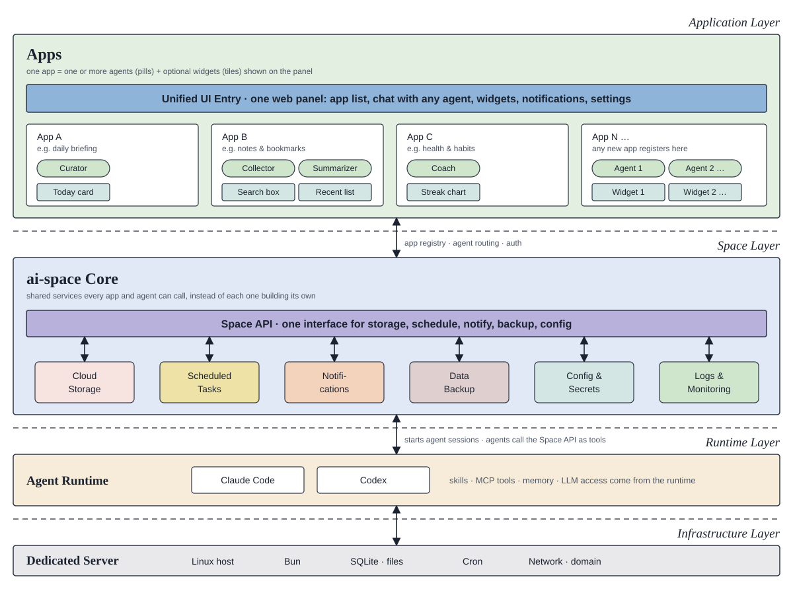

# ai-space

A personal AI space: one web entry, many apps, each app run by one or more AI agents, all sharing a common set of services on a single dedicated server.

## Architecture



Top to bottom:

- **Application layer.** A unified web UI is the only entry point. It lists the installed apps, lets you chat with any agent, shows app widgets on the home panel, and carries notifications and settings. Each app owns one or more agents and may contribute one or more widgets.
- **Space layer (ai-space core).** Shared services that every app and agent can call through one Space API instead of building their own: cloud storage, scheduled tasks, notifications, data backup, config and secrets, logs and monitoring. The core also keeps the app registry, routes requests to the right agent, and handles auth.
- **Runtime layer.** Agents run as [Claude Code](https://claude.com/claude-code) or Codex sessions. Skills, MCP tools, memory, and LLM access come from the runtime; agents reach the Space API as tools.
- **Infrastructure layer.** Everything runs on one dedicated Linux server with Bun, SQLite and the filesystem, cron, and a public domain.

The diagram source is `docs/architecture.svg`.

## Workspace

Everything ai-space owns on a machine lives in one directory, `~/.ai-space` by default (override with `SPACE_HOME`). It is created on first boot or by `bun run init`:

```
~/.ai-space/
├── core/    ai-space itself (this repository) when deployed with deploy/
├── apps/    one directory per app; any app with a space.yaml is scheduled automatically
├── data/    runtime state (SQLite) and per-app data directories
├── logs/
└── .env     ai-space configuration plus the secrets app manifests reference via ${VAR}
```

## Development

```bash
bun install
bun run init           # create ~/.ai-space (idempotent)
bun run start          # boot the Space API and the panel on 127.0.0.1:8700
bun run dev            # hot reload, including the web UI
bun run check          # typecheck + tests
```

Local configuration goes in `~/.ai-space/.env` (see `.env.example`); process environment variables win over it.

## Deployment

One line on a fresh machine, as the user that will own ai-space (installs Bun and Claude Code, clones into `~/.ai-space/core`, installs the unit, then runs the interactive setup on the terminal):

```bash
curl -fsSL https://raw.githubusercontent.com/<owner>/ai-space/main/deploy/bootstrap.sh | bash
```

For a private repository, host `deploy/bootstrap.sh` on a URL of your own and pass a token: `curl -fsSL https://<your-domain>/install.sh | AI_SPACE_GIT_TOKEN=<token> bash`. See [docs/install.md](docs/install.md).

By hand: user-level systemd, no sudo. On the target machine, with Bun installed under `~/.bun`:

```bash
ssh <host> "git init --bare ~/ai-space.git"
scp deploy/post-receive <host>:~/ai-space.git/hooks/post-receive && ssh <host> chmod +x ~/ai-space.git/hooks/post-receive
git remote add <host> <host>:~/ai-space.git
git push <host> main      # checks out into ~/.ai-space/core, runs deploy/install.sh, restarts the unit
```

`deploy/install.sh` installs `deploy/ai-space.service` into `~/.config/systemd/user/`, enables linger, and restarts the service. Logs: `journalctl --user -u ai-space -f`.

On a new machine, `bun run setup` (in `~/.ai-space/core`) walks through the rest interactively: it checks the tools ai-space spawns (claude, gh, cloudflared), asks for every workspace `.env` value section by section, sends a test notification, probes the bucket, and prints what is left to do on Cloudflare. The full procedure, from an empty user to a panel behind a domain and an access layer, is in [docs/install.md](docs/install.md).

See [docs/app-spec.md](docs/app-spec.md) for the app specification (what an app is, its layout, and the `space.yaml` contract), [skills/space-app](skills/space-app/SKILL.md) for the shared skill that walks an agent through creating, adopting or changing an app by that specification (with the app template under `skills/space-app/templates/`), [AGENTS.md](AGENTS.md) for the agent and contributor guide, including the commit format, and [CLAUDE.md](CLAUDE.md) for Bun conventions.

## Services

- **Scheduler** (`src/space/scheduler/`) - scheduled and event-driven tasks for apps: `at` / `every` / `cron` schedules, event `triggers` fed by `POST /api/events` (debounced, coalesced, delivered as the run's payload), `http` / `command` / `agent` targets, declared in each app's `space.yaml` and managed through `/api/tasks`. See [docs/scheduler.md](docs/scheduler.md).
- **Storage** (`src/space/storage/`) - per-app databases on SQLite or PostgreSQL and a per-app blob store on the filesystem or any S3-compatible bucket, declared in `space.yaml`, provisioned on sync and handed over through `<workspace>/data/<app>/space.env` (`DATABASE_URL`, `BLOB_URL`, `S3_*`). The managed blob API from the design is not implemented yet. See [docs/storage.md](docs/storage.md).
- **Backup** (`src/space/storage/backup/`) - every app's data directory snapshotted daily to an S3 bucket (SQLite via `VACUUM INTO`, state files, one `tar.zst` per app with a sidecar manifest), counted retention, a weekly verification task that opens the newest snapshot, and `restore` into a directory or in place. See [docs/backup.md](docs/backup.md).
- **Notify** (`src/space/notify/`) - one-way notifications to chat apps (Telegram, Discord, Slack, Feishu, DingTalk, WeCom, Bark, ntfy, generic webhook). Channels are configured once in the workspace `.env` as `SPACE_NOTIFY_<NAME>` URLs; apps declare which they may use in `space.yaml` and send one `POST /api/notify`. Deliveries are queued, rate limited, retried and recorded; the scheduler reports failing tasks through it. See [docs/notify.md](docs/notify.md).
- **Panel** (`src/space/panel/`, `src/space/agents/`, `src/web/`) - the web entry at `/`: a launcher of every app in the workspace (icon, entry URL, health), a chat window that opens a Claude Code session as any declared agent or as the space agent, widget cards fed by the apps, a read-only view of every scheduled task with its run history, and an edit mode to add an app from a link, hide, reorder or uninstall. In English or Chinese, following the browser or a setting; apps translate their own titles in `space.yaml` ([docs/i18n.md](docs/i18n.md)). See [docs/panel.md](docs/panel.md).

## Status

Early stage. Scheduler, storage, notifications, the panel (with agent chat and widgets) and peers (one panel over several machines, [docs/peers.md](docs/peers.md)) are in place. Follow-up work, roughly in order:

- **Service supervision** - start `service.command`, restart it on failure, collect its logs under `<workspace>/logs/<app>/`; the panel probes health directly until then.
- **Skills mounting** - make `skills:` from the manifest available to agent sessions.
- **Managed blob API and backups** - the parts of the storage design that are not implemented yet.
